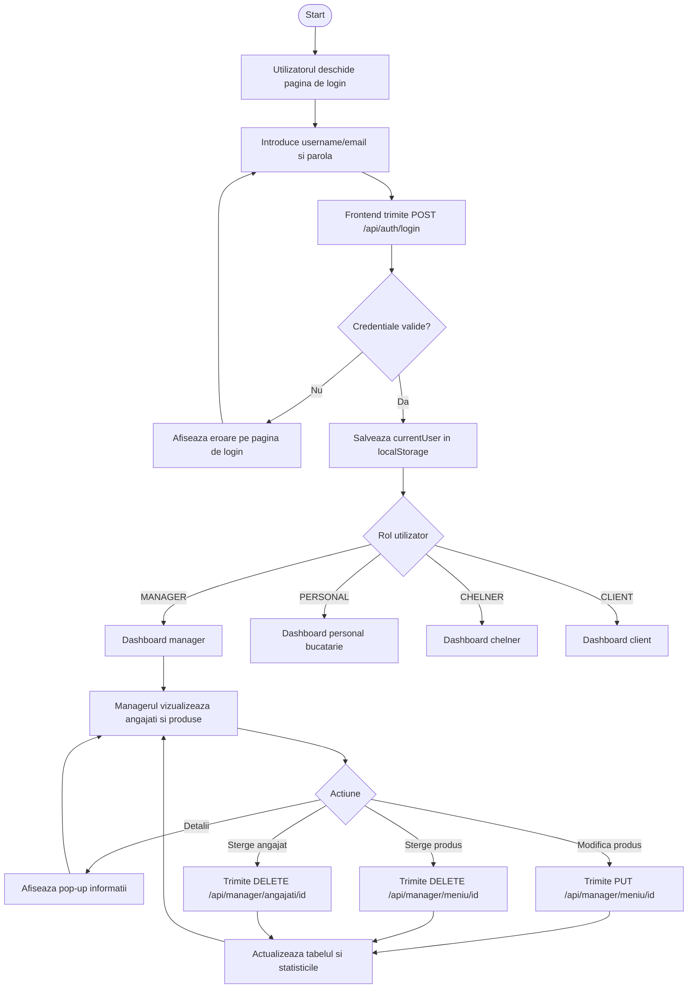
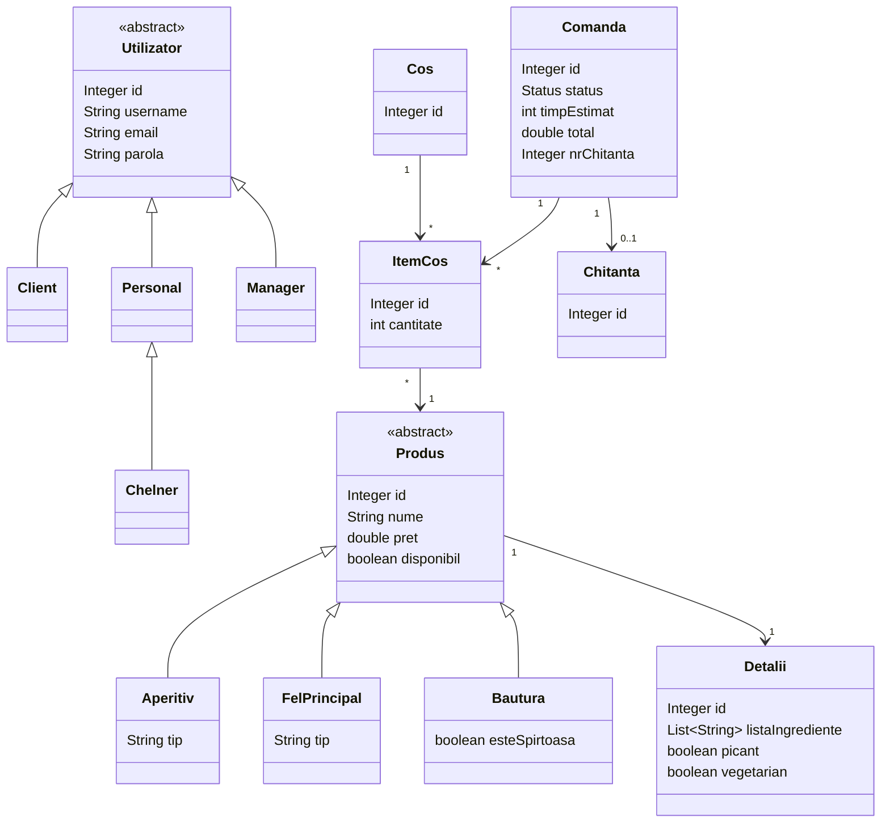

# Diagrame Miclea Paul

## Diagrama de activitate 1

```mermaid
flowchart TD
    A([Start]) --> B[Utilizatorul deschide pagina de login]
    B --> C[Introduce username/email si parola]
    C --> D[Frontend trimite POST /api/auth/login]
    D --> E{Credentiale valide?}
    E -- Nu --> F[Afiseaza eroare pe pagina de login]
    F --> C
    E -- Da --> G[Salveaza currentUser in localStorage]
    G --> H{Rol utilizator}
    H -- MANAGER --> I[Dashboard manager]
    H -- PERSONAL --> J[Dashboard personal bucatarie]
    H -- CHELNER --> K[Dashboard chelner]
    H -- CLIENT --> L[Dashboard client]
    I --> M[Managerul vizualizeaza angajati si produse]
    M --> N{Actiune}
    N -- Detalii --> O[Afiseaza pop-up informatii]
    N -- Modifica produs --> P[Trimite PUT /api/manager/meniu/id]
    N -- Sterge produs --> Q[Trimite DELETE /api/manager/meniu/id]
    N -- Sterge angajat --> R[Trimite DELETE /api/manager/angajati/id]
    O --> M
    P --> S[Actualizeaza tabelul si statisticile]
    Q --> S
    R --> S
    S --> M
```

## Diagrama de clasa 1

```mermaid
classDiagram
    class Utilizator {
        <<abstract>>
        Integer id
        String username
        String email
        String parola
    }

    class Client
    class Personal
    class Manager
    class Chelner

    Utilizator <|-- Client
    Utilizator <|-- Personal
    Utilizator <|-- Manager
    Personal <|-- Chelner

    class Produs {
        <<abstract>>
        Integer id
        String nume
        double pret
        boolean disponibil
    }

    class Aperitiv {
        String tip
    }

    class FelPrincipal {
        String tip
    }

    class Bautura {
        boolean esteSpirtoasa
    }

    class Detalii {
        Integer id
        List~String~ listaIngrediente
        boolean picant
        boolean vegetarian
    }

    Produs <|-- Aperitiv
    Produs <|-- FelPrincipal
    Produs <|-- Bautura
    Produs "1" --> "1" Detalii

    class ItemCos {
        Integer id
        int cantitate
    }

    class Cos {
        Integer id
    }

    class Comanda {
        Integer id
        Status status
        int timpEstimat
        double total
        Integer nrChitanta
    }

    class Chitanta {
        Integer id
    }

    ItemCos "*" --> "1" Produs
    Cos "1" --> "*" ItemCos
    Comanda "1" --> "*" ItemCos
    Comanda "1" --> "0..1" Chitanta
```
